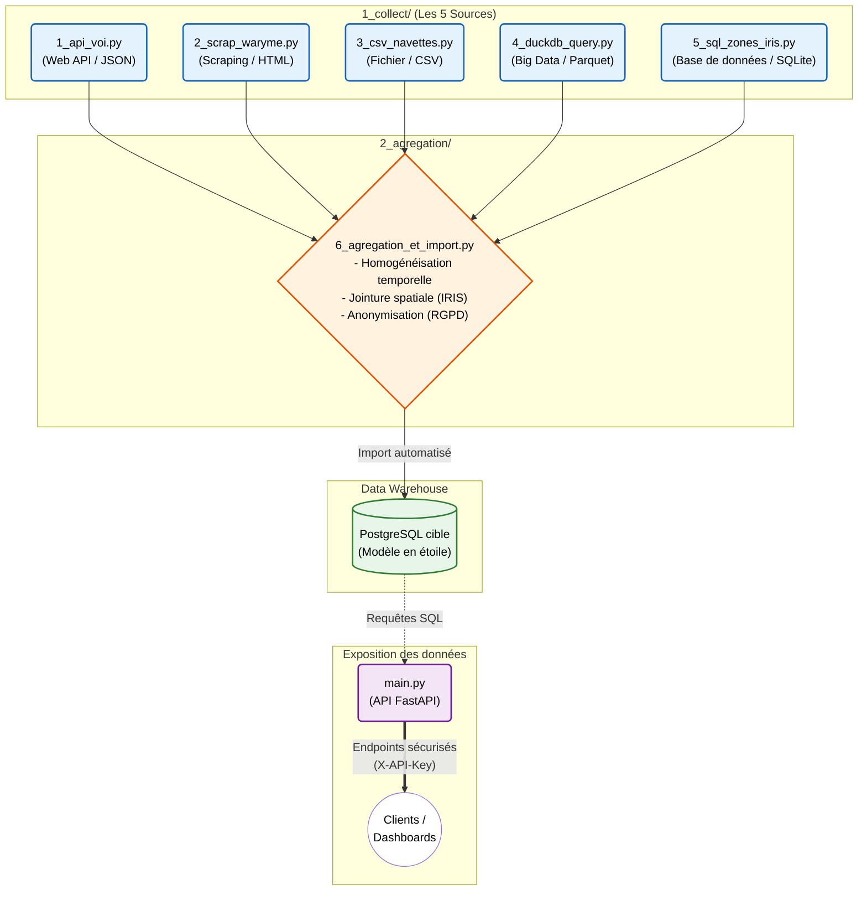

# Observatoire de la Mobilité et de la Sécurité (Marseille)

## Contexte du projet (Livrable E1)
Socle technique d'ingénierie de données (Data Engineering) pour la création d'un "Observatoire de la Mobilité" à Marseille.

L'objectif est d'agréger des données hétérogènes (trottinettes VOI, navettes maritimes, alertes de sécurité RTM) afin de les consolider dans un **entrepôt de données unifié** (modèle en étoile) et de les mettre à disposition via une **API REST sécurisée**.

---

## Quickstart (Guide de Lancement Rapide)

### 1. Prérequis
* Python 3.12+
* `uv` (Gestionnaire de paquets)
* Base de données locale (SQLite) générée via le script d'amorçage `setup/create_mock_db.py`.

### 2. Installation
Cloner le dépôt et installez les dépendances dans un environnement virtuel :
```bash
git clone https://github.com/bruno-coulet/mobilites.git
cd mobilites
# Créer l'environnement virtuel
uv init
# Importer les dépendances
uv add pandas duckdb sqlalchemy psycopg2-binary fastapi uvicorn playwright python-dotenv requests pyarrow
# Installer le navigateur pour playwright
uv run playwright install chromium
# Amorcer la base de données spatiale locale (Zones IRIS)
uv run setup/create_mock_db.py
```
>Note : Configurer votre fichier `.env` à la racine (voir `.env.example`) avec `DATABASE_URL=sqlite:///data/mobilite_db.sqlite` et les clés API.


### 3. Exécution du Pipeline de Données
Vous pouvez tester le pipeline étape par étape :
Étape A : Collecte des 5 sources (Mode Démonstration)
```bash
uv run 1_collect/1_api_voi.py
uv run 1_collect/2_scrap_waryme.py
uv run 1_collect/3_csv_navettes.py
uv run 1_collect/4_duckdb_query.py
uv run 1_collect/5_sql_zones_iris.py
```
Étape B : Agrégation, RGPD et Import
```bash
uv run 2_agregation/6_agregation_et_import.py
```
Étape C : Lancement de l'API de Restitution L'API FastAPI se trouve à la racine du projet (main.py).
```bash
uv run uvicorn main:app --reload --port 8001
```
L'API et sa documentation Swagger sécurisée seront accessibles sur : http://localhost:8001/docs.


## Architecture du Code



Le pipeline automatise l'extraction depuis 5 systèmes de natures différentes (sous dossier `1_collect/`) :
|Script|Type de Source|Description|Format / Techno|
|-|-|-|-|
|1_api_voi.py|Web API|API MDS Provider (VOI) : Trajets de trottinettes.|JSON (requests)|
|2_scrap_waryme.py|Web Scraping|Interface Waryme (RTM) : Alertes de sécurité.|HTML (Playwright)|
|3_csv_navettes.py|Fichier|Navettes Maritimes : Historique d'exploitation.|CSV (pandas)|
|4_duckdb_query.py|Big Data|Historique massifs de trajets VOI.|.parquet (DuckDB)|
|5_sql_zones_iris.py|Base de Données|Référentiel IRIS : Découpage géographique (Marseille).|SQL (sqlalchemy)|


## Agrégation et Conformité RGPD
Le script central `2_agregation/6_agregation_et_import.py` fait office de pipeline :

**Jointure Spatiale :** Croisement de toutes les sources sur une clé commune : le code IRIS.

**Privacy by Design (RGPD) :** Anonymisation stricte en mémoire (suppression des identifiants et téléphones) avant toute persistance en base de données des données Waryme.

**Modélisation & Import SQL :** Import automatisé dans PostgreSQL selon un modèle en étoile (Méthode Merise).


## Restitution (API REST Sécurisée)
Les données sont exposées via `main.py` (FastAPI).
**Sécurisation :** Protection de tous les endpoints par une authentification `X-API-Key` (Standard OWASP).
**Documentation :** Interface interactive OpenAPI (Swagger).


