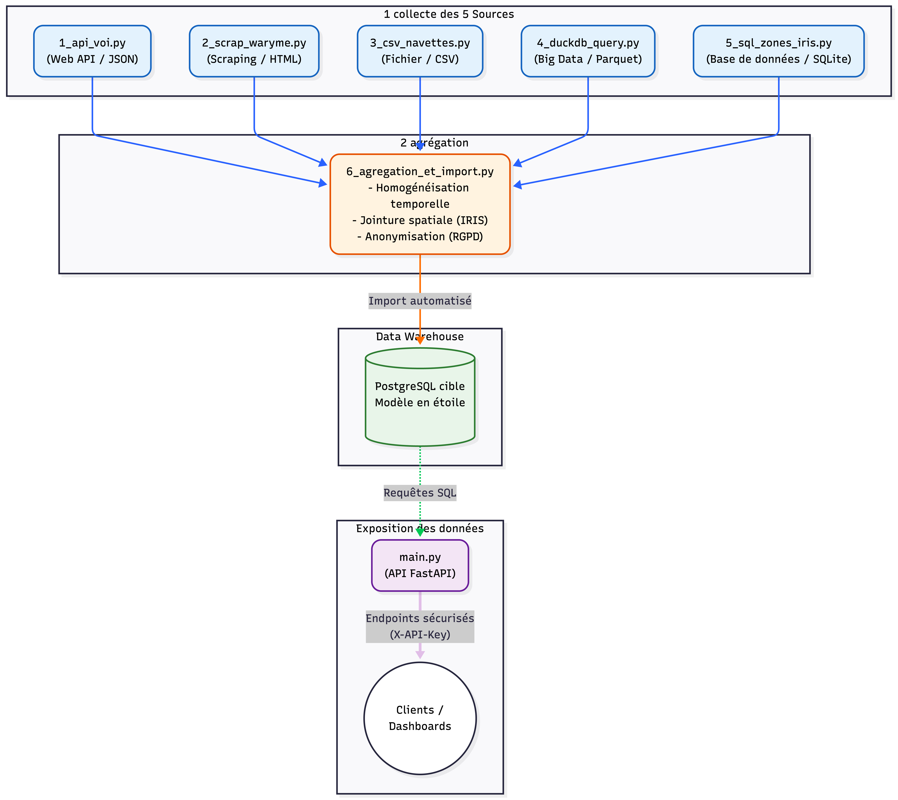

# Observatoire de la Mobilité et de la Sécurité (Marseille)

## Contexte du projet (Livrable E1)
Socle technique d'ingénierie de données pour la création d'un **Observatoire de la Mobilité** à Marseille.

L'objectif est d'agréger des données hétérogènes
- trottinettes VOI
- navettes maritimes
- alertes de sécurité RTM

afin de les consolider dans un **entrepôt de données unifié** (modèle en étoile) et de les mettre à disposition via une **API REST sécurisée**.


## Quickstart (Guide de Lancement Rapide)

### A) Prérequis et Configuration
* Python 3.12+ et `uv` (Gestionnaire de paquets) installés.


* Configurer le fichier `.env` à la racine (voir `.env.example`) en y renseignant :
  * `DATABASE_URL=sqlite:///data/mobilite_db.sqlite`
  * `MOBILITE_API_KEY=votre_cle_secrete` (Inventer une clé pour protéger l'accès local à votre API)
  * Les identifiants de connexion aux services externes (Waryme, API VOI).

### Installation
Cloner le dépôt et installez les dépendances dans un environnement virtuel :
```bash
git clone https://github.com/bruno-coulet/mobilites.git
cd mobilites
# Créer l'environnement virtuel
uv init
# Importer les dépendances
uv add pandas duckdb sqlalchemy psycopg2-binary fastapi uvicorn playwright python-dotenv requests pyarrow
# Installer le navigateur pour playwright
uv run playwright install chromium
```


Les commandes ci-dessous doivent être exécutées depuis la racine du projet (`mobilites/`) :


### B) Création de la base de données locale
Initialiser la base de données locale ``SQLite``
Elle sert de référentiel géographique (zones IRIS).

```bash
uv run setup/create_mock_db.py
```
Vérifier que le fichier ``mobilite_db.sqlite`` a bien été créé dans le dossier ``data/``

### C) Collecte des données (Extraction)
Ces scripts constituent la première étape de l'ETL (Extract). Ils se connectent aux différentes sources (API, Web, Big Data) pour récupérer la donnée fraîche et la stocker dans ``data/``.

On peut les lancer individuellement :
```python
uv run 1_collect/1_api_voi.py
uv run 1_collect/2_scrap_waryme.py
uv run 1_collect/3_csv_navettes.py
uv run 1_collect/4_duckdb_query.py
uv run 1_collect/5_sql_zones_iris.py
```

### D) Traitement, Agrégation et Import (RGPD)
C'est le cœur du traitement de données, ce script :
- fusionne toutes les sources
- applique l'anonymisation pour le RGPD (suppression des noms en mémoire vive)
- importe les données propres dans le modèle en étoile de la base de données.

```python
uv run python 2_agregation/6_agregation_et_import.py
```

### E) Lancement de l'API de Restitution
Une fois la base de données remplie
On peut lancer le serveur web FastAPI.<br>
Celui-ci exposera les données via des endpoints sécurisés, sans faire aucun calcul lourd.
```python
uv run python main.py
```

L'API et sa documentation Swagger interactive (sécurisée par ``X-API-Key``) seront alors accessibles sur : http://localhost:8001/docs


```bash
uv run uvicorn main:app --reload --port 8001
```


---


## Architecture du Code




Le pipeline automatise l'extraction depuis 5 systèmes de natures différentes (sous dossier `1_collect/`) :
|Script|Type de Source|Description|Format / Techno|
|-|-|-|-|
|1_api_voi.py|Web API|API MDS Provider (VOI) : Trajets de trottinettes.|JSON (requests)|
|2_scrap_waryme.py|Web Scraping|Interface Waryme (RTM) : Alertes de sécurité.|HTML (Playwright)|
|3_csv_navettes.py|Fichier|Navettes Maritimes : Historique d'exploitation.|CSV (pandas)|
|4_duckdb_query.py|Big Data|Historique massifs de trajets VOI.|.parquet (DuckDB)|
|5_sql_zones_iris.py|Base de Données|Référentiel IRIS : Découpage géographique (Marseille).|SQL (sqlalchemy)|


## Agrégation et Conformité RGPD
Le script central `2_agregation/6_agregation_et_import.py` fait office de pipeline :

**Jointure Spatiale :** Croisement de toutes les sources sur une clé commune : le code IRIS.

**Privacy by Design (RGPD) :** Anonymisation stricte en mémoire (suppression des identifiants et téléphones) avant toute persistance en base de données des données Waryme.

**Modélisation & Import SQL :** Import automatisé dans PostgreSQL selon un modèle en étoile (Méthode Merise).


## Restitution (API REST Sécurisée)
Les données sont exposées via `main.py` (FastAPI).<br>
**Sécurisation :** Protection de tous les endpoints par une authentification `X-API-Key` (Standard OWASP).<br>
**Documentation :** Interface interactive OpenAPI (Swagger).

**Test interactif :** Pour exécuter des requêtes depuis l'interface Swagger (`http://localhost:8001/docs`), cliquer sur le bouton **Authorize** et renseigner la valeur de `MOBILITE_API_KEY` définie dans le fichier `.env`. Le cadenas se fermera, confirmant que l'en-tête `X-API-Key` sera bien injecté dans les requêtes.


#### Qualité du Code (Linter)
Afin de garantir la propreté, la maintenabilité et la conformité du code avec les standards Python (PEP 8), le code est vérifié et formaté à l'aide du linter **Ruff**.

Pour lancer l'analyse de code localement à tout moment, lancer la commande suivante dans un terminal :
`uv run ruff check`

*(L'utilisation de cet outil s'inscrit dans les bonnes pratiques de développement, préparant ainsi le terrain pour l'automatisation des tests et l'intégration continue).*


